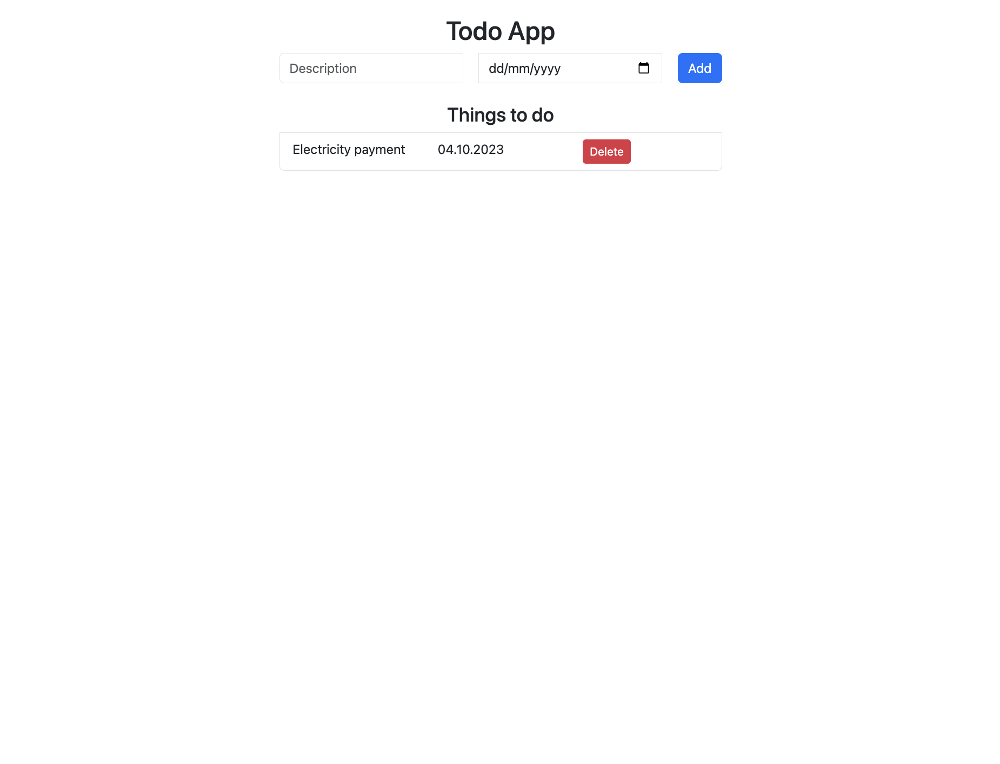

# Angular Todo App

Welcome to my first Angular application, the **Todo App**! I built this app while learning Angular, and it's been an exciting journey to explore the fundamentals of Angular development. In this project, I've gained hands-on experience with various Angular concepts, such as **data binding**, **looping**, **conditional rendering** in components, and using the `ngOnInit` lifecycle hook.

## Features

This Todo App reflects my journey in learning Angular and showcases the following key Angular concepts:

- **Data Binding:** I've learned how to bind data between my component class and template to create dynamic user interfaces.

- **Looping:** You can see how I've used `*ngFor` to iterate through a list of todos and display them in a list format.

- **Conditional Rendering:** I've applied the `*ngIf` directive to conditionally display content, such as showing a message when there are no todos.

- **Lifecycle Hook (`ngOnInit`):** I've utilized the `ngOnInit` lifecycle hook to load data when the component is initialized. This is a common practice for fetching data from APIs or setting up the initial state of the component.

